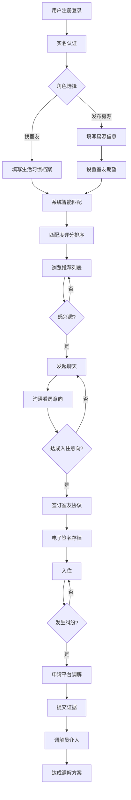

## 1. 产品概述

室友匹配平台是一个连接租房者和寻找室友的在线平台，解决城市租房人群找室友难、合租矛盾多的痛点。通过智能匹配算法、实名认证、电子协议等功能，打造安全、便捷、和谐的合租生态。

- 核心目标：帮助用户找到生活习惯匹配的室友，降低合租纠纷，提供全流程租住服务
- 目标用户：城市年轻租房人群、有房出租的房东、需要补位室友的现有租客
- 市场价值：每年新增千万级租房人口，合租需求旺盛，市场规模超千亿

## 2. 核心功能

### 2.1 用户角色

| 角色 | 注册方式 | 核心权限 |
|------|----------|----------|
| 房源发布者 | 手机号+实名认证 | 发布房源、设置室友期望、查看匹配、发起聊天、签订协议 |
| 找室友者 | 手机号+实名认证 | 创建生活档案、浏览房源、查看匹配度、发起聊天、签订协议 |
| 平台管理员 | 后台账号 | 用户管理、纠纷调解、协议审核、数据统计 |

### 2.2 功能模块

1. **首页**：房源推荐、匹配推荐、搜索筛选、导航入口
2. **房源发布**：房间信息编辑、照片上传、设施标注、室友期望设置
3. **个人档案**：生活习惯填写、作息时间、宠物偏好、吸烟习惯、实名认证
4. **智能匹配**：匹配度评分、双向推荐、匹配详情展示
5. **即时聊天**：消息列表、聊天窗口、看房邀约、协议入口
6. **室友协议**：协议模板、条款自定义、电子签名、存档管理
7. **纠纷调解**：纠纷申请、证据提交、在线调解、处理记录
8. **补位招募**：现有室友发布需求、申请人背景核验、集体投票

### 2.3 页面详情

| 页面名称 | 模块名称 | 功能描述 |
|----------|----------|----------|
| 首页 | 搜索区域 | 位置、租金、房型筛选，智能排序 |
| 首页 | 推荐房源 | 卡片式展示，显示匹配度、租金、位置 |
| 首页 | 匹配推荐 | 展示与用户生活习惯高度匹配的室友/房源 |
| 房源详情 | 基本信息 | 位置、租金、面积、朝向、楼层 |
| 房源详情 | 照片展示 | 房间照片轮播、公共区域照片 |
| 房源详情 | 设施列表 | 家具、家电、网络、水电燃气等 |
| 房源详情 | 室友期望 | 作息、宠物、吸烟、性别等偏好 |
| 房源详情 | 匹配度 | 显示当前用户与房源的匹配评分 |
| 房源发布 | 信息填写 | 表单分步填写，实时预览 |
| 房源发布 | 照片上传 | 拖拽上传、图片裁剪、压缩优化 |
| 个人档案 | 生活习惯 | 作息时间、清洁频率、社交偏好 |
| 个人档案 | 宠物吸烟 | 是否养宠、宠物类型、吸烟习惯 |
| 个人档案 | 实名认证 | 身份证OCR、人脸核验 |
| 匹配结果 | 匹配列表 | 按匹配度排序，显示详细匹配维度 |
| 匹配结果 | 匹配详情 | 各项指标评分雷达图、优劣势分析 |
| 聊天列表 | 会话列表 | 最近消息、未读提醒、匹配度标签 |
| 聊天窗口 | 消息收发 | 文字、图片、看房邀约卡片 |
| 协议签署 | 协议内容 | 公共区域规则、费用分摊、违约责任 |
| 协议签署 | 电子签名 | 画布签名、时间戳、双方确认 |
| 纠纷调解 | 申请提交 | 纠纷类型、事件描述、证据上传 |
| 纠纷调解 | 调解进度 | 调解员分配、沟通记录、处理结果 |
| 补位招募 | 需求发布 | 现有房间情况、招募原因、期望条件 |
| 补位招募 | 背景核验 | 申请人信息展示、实名认证状态、评价记录 |

## 3. 核心流程

用户在平台上发布房源或创建个人档案后，系统自动计算匹配度并进行双向推荐。双方感兴趣后可发起聊天沟通，达成意向后在线签订室友协议。入住后如发生纠纷，可申请平台调解。

## 4. 用户界面设计

### 4.1 设计风格

- **主色调**：温暖的橙色（#FF7A45）代表家的温馨，搭配深青色（#2D4A5E）体现专业可信赖
- **辅助色**：薄荷绿（#4ECDC4）用于匹配成功、高匹配度提示；珊瑚红（#FF6B6B）用于重要提醒
- **中性色**：暖灰色系为主，营造舒适、干净的视觉体验
- **按钮风格**：圆角8px，渐变填充，悬停有轻微上浮效果和阴影变化
- **字体**：标题使用「思源黑体 Bold」，正文使用「思源黑体 Regular」，数字使用等宽字体
- **布局风格**：卡片式布局，充足留白，清晰的信息层级，柔和阴影
- **图标风格**：线性图标，统一2px线宽，圆角端点，与文字保持协调

### 4.2 页面设计概述

| 页面名称 | 模块名称 | UI元素 |
|----------|----------|--------|
| 首页 | 搜索区域 | 大圆角搜索框，位置选择器，滑动条租金筛选，带有微妙阴影 |
| 首页 | 推荐卡片 | 悬停时卡片上移3px，阴影加深，匹配度圆环动画展示 |
| 首页 | 匹配推荐 | 横向滚动列表，卡片带匹配度标签，渐入动画 |
| 房源详情 | 照片轮播 | 大图展示，平滑切换过渡，指示器动画 |
| 房源详情 | 设施图标 | 网格布局，彩色图标配文字说明 |
| 房源详情 | 匹配度雷达图 | 六维匹配展示，彩色填充，数据加载动画 |
| 个人档案 | 生活习惯 | 标签选择器，选中态有缩放动画 |
| 聊天窗口 | 消息气泡 | 区分发送方/接收方，时间戳显示，已读状态 |
| 协议签署 | 签名画布 | 支持鼠标/触摸签名，清空、撤销功能 |
| 纠纷调解 | 进度时间轴 | 垂直时间线，节点状态动画 |

### 4.3 响应式设计

- 采用桌面优先设计，断点设置为1280px、768px、480px
- 桌面端三栏布局，平板端双栏，移动端单栏
- 导航栏在移动端转为底部Tab栏
- 表单在移动端优化为全宽输入，增大点击区域
- 图片在移动端自动适配宽度，加载适配尺寸
- 触摸设备优化滑动操作，减少精确点击需求

### 4.4 动效设计

- 页面加载：内容区域淡入，骨架屏过渡
- 匹配计算：进度条动画，匹配度数字滚动
- 卡片交互：悬停微缩放，阴影过渡
- 消息发送：气泡滑入动画
- 签名完成：确认动效，印章盖下效果
- 状态变更：Toast通知从顶部滑入
