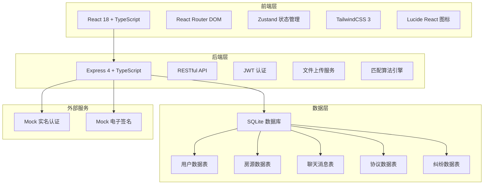
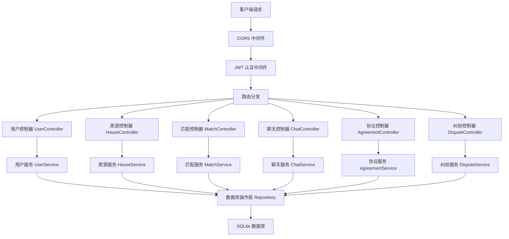
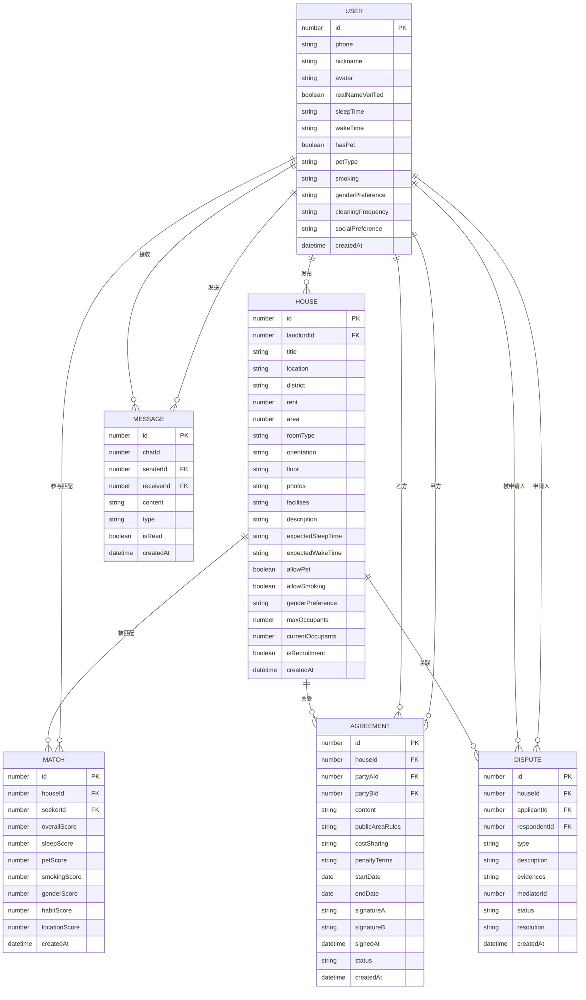

## 1. 架构设计



## 2. 技术描述

- **前端**：React 18 + TypeScript + Vite + TailwindCSS 3 + React Router DOM + Zustand + Lucide React
- **后端**：Express 4 + TypeScript + CORS + JWT认证 + Multer文件上传
- **数据库**：SQLite3 + better-sqlite3（嵌入式数据库，无需额外服务）
- **初始化工具**：vite-init 使用 react-express-ts 模板
- **模拟数据**：预置100+条房源、用户、聊天记录Mock数据

## 3. 路由定义

| 路由 | 页面 | 权限 |
|------|------|------|
| / | 首页 | 公开 |
| /login | 登录页 | 公开 |
| /register | 注册页 | 公开 |
| /houses | 房源列表 | 登录用户 |
| /houses/:id | 房源详情 | 登录用户 |
| /publish | 发布房源 | 登录用户+实名认证 |
| /profile | 个人档案 | 登录用户 |
| /profile/edit | 编辑档案 | 登录用户 |
| /matches | 匹配推荐 | 登录用户+实名认证 |
| /chat | 聊天列表 | 登录用户+实名认证 |
| /chat/:id | 聊天窗口 | 登录用户+实名认证 |
| /agreement/:id | 签署协议 | 相关用户 |
| /disputes | 纠纷列表 | 登录用户 |
| /disputes/new | 申请调解 | 登录用户 |
| /disputes/:id | 调解详情 | 相关用户 |
| /recruitment | 补位招募 | 登录用户 |
| /verification | 实名认证 | 登录用户 |

## 4. API 定义

```typescript
// 用户模块
interface User {
  id: number;
  phone: string;
  nickname: string;
  avatar: string;
  realNameVerified: boolean;
  idCard?: string;
  // 生活习惯
  sleepTime?: string;
  wakeTime?: string;
  hasPet: boolean;
  petType?: string;
  smoking: 'never' | 'occasionally' | 'often';
  genderPreference?: 'male' | 'female' | 'any';
  cleaningFrequency?: string;
  socialPreference?: string;
  createdAt: Date;
}

// 房源模块
interface House {
  id: number;
  landlordId: number;
  title: string;
  location: string;
  district: string;
  rent: number;
  area: number;
  roomType: string;
  orientation: string;
  floor: string;
  photos: string[];
  facilities: string[];
  description: string;
  // 室友期望
  expectedSleepTime?: string;
  expectedWakeTime?: string;
  allowPet: boolean;
  allowSmoking: boolean;
  genderPreference: 'male' | 'female' | 'any';
  maxOccupants: number;
  currentOccupants: number;
  isRecruitment: boolean;
  createdAt: Date;
}

// 匹配模块
interface Match {
  id: number;
  houseId: number;
  seekerId: number;
  overallScore: number;
  sleepScore: number;
  petScore: number;
  smokingScore: number;
  genderScore: number;
  habitScore: number;
  locationScore: number;
  createdAt: Date;
}

// 聊天模块
interface Message {
  id: number;
  chatId: number;
  senderId: number;
  receiverId: number;
  content: string;
  type: 'text' | 'image' | 'invitation' | 'agreement';
  isRead: boolean;
  createdAt: Date;
}

// 协议模块
interface Agreement {
  id: number;
  houseId: number;
  partyAId: number;
  partyBId: number;
  content: string;
  publicAreaRules: string;
  costSharing: string;
  penaltyTerms: string;
  startDate: Date;
  endDate: Date;
  signatureA?: string;
  signatureB?: string;
  signedAt?: Date;
  status: 'draft' | 'pending' | 'signed' | 'terminated';
  createdAt: Date;
}

// 纠纷模块
interface Dispute {
  id: number;
  houseId: number;
  applicantId: number;
  respondentId: number;
  type: string;
  description: string;
  evidences: string[];
  mediatorId?: number;
  status: 'pending' | 'mediating' | 'resolved' | 'closed';
  resolution?: string;
  createdAt: Date;
}
```

## 5. 服务器架构图



## 6. 数据模型

### 6.1 ER图



### 6.2 DDL 语句

```sql
-- 用户表
CREATE TABLE users (
    id INTEGER PRIMARY KEY AUTOINCREMENT,
    phone VARCHAR(20) UNIQUE NOT NULL,
    nickname VARCHAR(50) NOT NULL,
    avatar VARCHAR(255),
    password_hash VARCHAR(255) NOT NULL,
    real_name_verified BOOLEAN DEFAULT 0,
    id_card VARCHAR(18),
    real_name VARCHAR(50),
    sleep_time VARCHAR(10),
    wake_time VARCHAR(10),
    has_pet BOOLEAN DEFAULT 0,
    pet_type VARCHAR(50),
    smoking VARCHAR(20) DEFAULT 'never',
    gender_preference VARCHAR(10) DEFAULT 'any',
    cleaning_frequency VARCHAR(50),
    social_preference VARCHAR(50),
    created_at DATETIME DEFAULT CURRENT_TIMESTAMP
);

-- 房源表
CREATE TABLE houses (
    id INTEGER PRIMARY KEY AUTOINCREMENT,
    landlord_id INTEGER NOT NULL,
    title VARCHAR(100) NOT NULL,
    location VARCHAR(255) NOT NULL,
    district VARCHAR(50) NOT NULL,
    rent INTEGER NOT NULL,
    area INTEGER NOT NULL,
    room_type VARCHAR(50) NOT NULL,
    orientation VARCHAR(20),
    floor VARCHAR(50),
    photos TEXT,
    facilities TEXT,
    description TEXT,
    expected_sleep_time VARCHAR(10),
    expected_wake_time VARCHAR(10),
    allow_pet BOOLEAN DEFAULT 0,
    allow_smoking BOOLEAN DEFAULT 0,
    gender_preference VARCHAR(10) DEFAULT 'any',
    max_occupants INTEGER DEFAULT 1,
    current_occupants INTEGER DEFAULT 0,
    is_recruitment BOOLEAN DEFAULT 0,
    created_at DATETIME DEFAULT CURRENT_TIMESTAMP,
    FOREIGN KEY (landlord_id) REFERENCES users(id)
);

-- 匹配表
CREATE TABLE matches (
    id INTEGER PRIMARY KEY AUTOINCREMENT,
    house_id INTEGER NOT NULL,
    seeker_id INTEGER NOT NULL,
    overall_score INTEGER NOT NULL,
    sleep_score INTEGER NOT NULL,
    pet_score INTEGER NOT NULL,
    smoking_score INTEGER NOT NULL,
    gender_score INTEGER NOT NULL,
    habit_score INTEGER NOT NULL,
    location_score INTEGER NOT NULL,
    created_at DATETIME DEFAULT CURRENT_TIMESTAMP,
    FOREIGN KEY (house_id) REFERENCES houses(id),
    FOREIGN KEY (seeker_id) REFERENCES users(id),
    UNIQUE(house_id, seeker_id)
);

-- 聊天消息表
CREATE TABLE messages (
    id INTEGER PRIMARY KEY AUTOINCREMENT,
    chat_id VARCHAR(50) NOT NULL,
    sender_id INTEGER NOT NULL,
    receiver_id INTEGER NOT NULL,
    content TEXT NOT NULL,
    type VARCHAR(20) DEFAULT 'text',
    is_read BOOLEAN DEFAULT 0,
    created_at DATETIME DEFAULT CURRENT_TIMESTAMP,
    FOREIGN KEY (sender_id) REFERENCES users(id),
    FOREIGN KEY (receiver_id) REFERENCES users(id)
);

-- 协议表
CREATE TABLE agreements (
    id INTEGER PRIMARY KEY AUTOINCREMENT,
    house_id INTEGER NOT NULL,
    party_a_id INTEGER NOT NULL,
    party_b_id INTEGER NOT NULL,
    content TEXT,
    public_area_rules TEXT,
    cost_sharing TEXT,
    penalty_terms TEXT,
    start_date DATE,
    end_date DATE,
    signature_a TEXT,
    signature_b TEXT,
    signed_at DATETIME,
    status VARCHAR(20) DEFAULT 'draft',
    created_at DATETIME DEFAULT CURRENT_TIMESTAMP,
    FOREIGN KEY (house_id) REFERENCES houses(id),
    FOREIGN KEY (party_a_id) REFERENCES users(id),
    FOREIGN KEY (party_b_id) REFERENCES users(id)
);

-- 纠纷表
CREATE TABLE disputes (
    id INTEGER PRIMARY KEY AUTOINCREMENT,
    house_id INTEGER NOT NULL,
    applicant_id INTEGER NOT NULL,
    respondent_id INTEGER NOT NULL,
    type VARCHAR(50) NOT NULL,
    description TEXT NOT NULL,
    evidences TEXT,
    mediator_id INTEGER,
    status VARCHAR(20) DEFAULT 'pending',
    resolution TEXT,
    created_at DATETIME DEFAULT CURRENT_TIMESTAMP,
    FOREIGN KEY (house_id) REFERENCES houses(id),
    FOREIGN KEY (applicant_id) REFERENCES users(id),
    FOREIGN KEY (respondent_id) REFERENCES users(id)
);

-- 调解消息表
CREATE TABLE mediation_messages (
    id INTEGER PRIMARY KEY AUTOINCREMENT,
    dispute_id INTEGER NOT NULL,
    sender_id INTEGER NOT NULL,
    sender_role VARCHAR(20) NOT NULL,
    content TEXT NOT NULL,
    created_at DATETIME DEFAULT CURRENT_TIMESTAMP,
    FOREIGN KEY (dispute_id) REFERENCES disputes(id)
);

-- 创建索引
CREATE INDEX idx_houses_district ON houses(district);
CREATE INDEX idx_houses_rent ON houses(rent);
CREATE INDEX idx_matches_seeker ON matches(seeker_id);
CREATE INDEX idx_messages_chat ON messages(chat_id);
CREATE INDEX idx_messages_sender ON messages(sender_id);
CREATE INDEX idx_messages_receiver ON messages(receiver_id);
```
